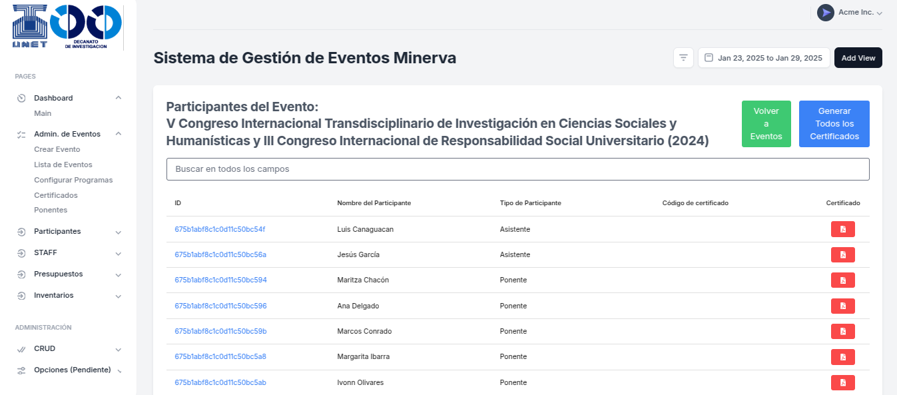

# Minerva Frontend



Minerva es un sistema diseñado para facilitar la generación de certificados con una gestión sencilla de la información de los participantes en eventos organizados por el Decanato de Investigación de la Universidad Nacional Experimental del Táchira (UNET).

## 🚀 Objetivo del Proyecto
Minerva permite la generación masiva de certificados para eventos auspiciados por el Decanato de Investigación y sus distintas coordinaciones de investigación, reduciendo el tiempo y esfuerzo en la gestión documental.

## 🎯 Problema que Resuelve
- Generación eficiente de certificados para eventos académicos.
- Gestión centralizada de los datos de los participantes.
- Simplificación del proceso de emisión y descarga de certificados en PDF.

## 👥 Usuarios Finales
- Analistas de soporte del Decanato de Investigación de la UNET.
- Coordinadora de Marketing del Decanato de Investigación de la UNET.

---

## 📋 Requisitos del Sistema
- Node.js 20.17.0
- npm 10.8.2
- Configuración de variables de entorno (ver instalación)

---

## 🛠 Instalación
### 1️⃣ Clonar el Repositorio
```bash
git clone https://gitlab.com/tu_usuario/Minerva-frontend.git
cd Minerva-frontend
```
### 2️⃣ Instalar Dependencias
```bash
npm install
```
### 3️⃣ Configurar Variables de Entorno
Crear un archivo `.env` en la raíz del proyecto y agregar:
```env
REACT_APP_BACKEND_URL="http://127.0.0.1:8000/"
```

---

## ▶️ Ejecución
### 1️⃣ Modo Desarrollo
```bash
npm run dev
```
Esto iniciará el servidor en `http://localhost:5173/`

### 2️⃣ Despliegue
Actualmente, el proyecto no está configurado para despliegue en plataformas como Vercel o Netlify, pero se espera su configuración en un contenedor Docker en el futuro.

---

## 📂 Estructura del Proyecto
Los componentes clave del frontend incluyen:
- `CertGen.jsx`: Genera certificados individuales.
- `CertGenAll.jsx`: Genera todos los certificados de un evento.
- `CertificateDocument.jsx`: Genera los PDFs de los certificados.

---

## 🤝 Contribuciones
Este proyecto es privado y solo los desarrolladores autorizados del Decanato de Investigación de la UNET pueden contribuir.

---

## 📜 Licencia
El proyecto incluye licencias relacionadas con:
- React
- TailwindCSS
- Node.js
- NPM

---

## 📧 Contacto
Para soporte técnico o consultas, contactar a:
**Ing. Oscar Castro**
- ✉️ castro.oscar18@gmail.com
- 📞 WhatsApp: 04147039597

---

## 📸 Capturas de Pantalla
Para agregar más imágenes o ejemplos, incluirlas en la carpeta `assets/` y referenciarlas en este archivo.
